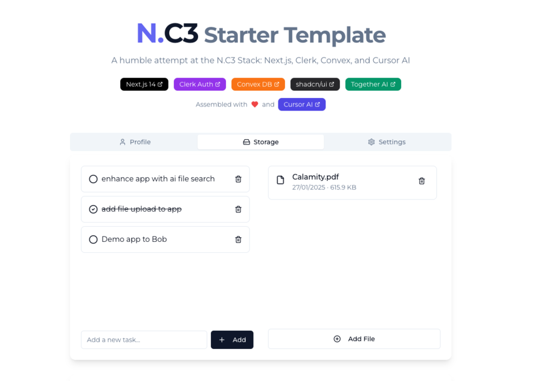

<a href="https://www.llamatutor.com">
  
  <h1 align="center">Llama Tutor</h1>
</a>

  An open source AI personal tutor. Powered by Llama 3 70B & Together.ai

## Tech Stack

### AI & Machine Learning
- [Together AI](https://docs.together.ai/) - LLM inference platform
- [Llama 3.1 70B](https://ai.meta.com/llama/) - Large Language Model from Meta

### Framework & Core
- [Next.js 14](https://nextjs.org/docs) - React framework with App Router
- [TypeScript](https://www.typescriptlang.org/docs/) - Type-safe JavaScript
- [Tailwind CSS](https://tailwindcss.com/docs) - Utility-first CSS framework

### Authentication & User Management
- [Clerk](https://clerk.com/docs) - Authentication and user management

### UI Components & Styling
- [shadcn/ui](https://ui.shadcn.com/docs) - Re-usable components built with Radix UI and Tailwind
- [Lucide Icons](https://lucide.dev/docs/lucide-react) - Beautiful open-source icons

### Data & API
- [Convex](https://docs.convex.dev/) - Backend platform and real-time database
- [Zod](https://zod.dev/) - TypeScript-first schema validation

### Search & Analytics
- [SERP API](https://serper.dev/) - Search engine results API
- [Helicone](https://docs.helicone.ai/) - LLM observability platform
- [Plausible](https://plausible.io/docs) - Privacy-friendly analytics

### Development Tools
- [Prettier](https://prettier.io/docs/en/) - Code formatter
- [ESLint](https://eslint.org/docs/latest/) - JavaScript linter

## Cloning & running

1. Fork or clone the repo
2. Create an account at [Together AI](https://togetherai.link) for the LLM
3. Create an account at [SERP API](https://serper.dev/) or with Azure ([Bing Search API](https://www.microsoft.com/en-us/bing/apis/bing-web-search-api))
4. Create an account at [Helicone](https://www.helicone.ai/) for observability
5. Create a `.env` (use the `.example.env` for reference) and replace the API keys
6. Run `npm install` and `npm run dev` to install dependencies and run locally

## Future Tasks

- [ ] Add file upload functionality with drag & drop support
- [ ] Implement OCR capabilities and searchable file content
- [ ] Add theme customization (dark/light mode + custom colors)
- [ ] Set up testing infrastructure
  - [ ] Unit tests with Jest/Vitest
  - [ ] E2E tests with Playwright/Cypress
  - [ ] Set up GitHub Actions for CI pipeline
