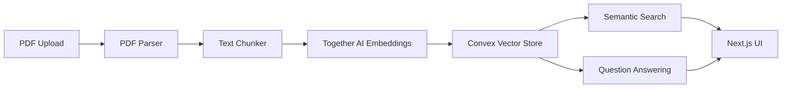

# PDF Analysis Feature Design

## Overview
A lightweight document analysis system that allows users to upload PDFs, search through their content, and ask questions about them using AI.

## System Design

### Architecture


### Components Breakdown

#### 1. PDF Processing
- **Library**: pdf-parse
- **Location**: `features/documents/utils/pdf.ts`
- **Key Functions**:
  - PDF text extraction
  - Basic metadata extraction (title, pages, etc.)
  - Error handling for corrupted files

#### 2. Text Processing
- **Library**: LangChain's RecursiveCharacterTextSplitter
- **Location**: `features/documents/utils/chunker.ts`
- **Configuration**:
  - Chunk size: 1000 tokens
  - Overlap: 200 tokens
  - Metadata preservation

#### 3. Vector Storage (Convex)
- **Schema**:
```typescript
// convex/schema.ts
{
  documents: {
    id: v.id("documents"),
    name: v.string(),
    chunks: v.array(v.object({
      text: v.string(),
      embedding: v.array(v.number()),
      metadata: v.object({
        page: v.number(),
        position: v.number()
      })
    })),
    userId: v.string(),
    _creationTime: v.number()
  }
}
```

#### 4. Embeddings & Search
- **Provider**: Together AI
- **Model**: together-embedding-v1
- **Location**: `features/documents/utils/embeddings.ts`
- **Key Functions**:
  - Text to vector conversion
  - Similarity search
  - Results ranking

#### 5. Question Answering
- **Model**: Llama 3.1 8B Turbo
- **Location**: `features/documents/utils/qa.ts`
- **Features**:
  - Context-aware responses
  - Source citations
  - Streaming output

### API Design

#### Convex Mutations
```typescript
// Upload & Process
uploadDocument: mutation({
  args: { name: v.string(), content: v.string() },
  handler: async (ctx, args) => {
    // Process PDF, chunk, embed, and store
  }
})

// Search
searchDocuments: query({
  args: { query: v.string() },
  handler: async (ctx, args) => {
    // Perform vector similarity search
  }
})

// Question Answering
askQuestion: action({
  args: { question: v.string(), documentId: v.id("documents") },
  handler: async (ctx, args) => {
    // Retrieve relevant chunks and generate answer
  }
})
```

### UI Components
- **Upload**: Drag & drop zone with progress indicator
- **Search**: Debounced search input with highlighted results
- **Chat**: Streaming response interface with document references

## Implementation Plan

### Phase 1: Infrastructure (Current)
1. [ ] Set up Convex schema
2. [ ] Configure Together AI client
3. [ ] Implement basic PDF parsing

### Phase 2: Core Features
1. [ ] Build upload component
2. [ ] Implement chunking and embedding
3. [ ] Create search interface

### Phase 3: Question Answering
1. [ ] Set up RAG pipeline
2. [ ] Add streaming responses
3. [ ] Build chat UI

## Cost Analysis
- Together AI embeddings: ~$0.0001 per 1K tokens
- Llama 3.1 8B Turbo: ~$0.0002 per 1K tokens
- Estimated cost per PDF (300KB): ~$0.05

## Future Considerations
- Batch processing for large documents
- Caching frequently accessed chunks
- Progressive loading for large result sets
- Error recovery and retry mechanisms 