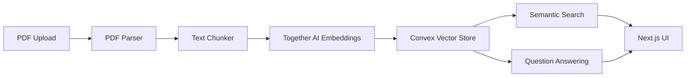

# PDF Analysis Feature Design

## Overview

A lightweight document analysis system that allows users to upload PDFs, search through their content, and ask questions about them using AI.

## System Design

### Architecture



### Components Breakdown

#### 1. PDF Processing

- **Library**: pdf-parse
- **Location**: `features/documents/utils/pdf.ts`
- **Key Functions**:
  - PDF text extraction
  - Basic metadata extraction (title, pages, etc.)
  - Error handling for corrupted files

#### 2. Text Processing

- **Library**: LangChain's RecursiveCharacterTextSplitter
- **Location**: `features/documents/utils/chunker.ts`
- **Configuration**:
  - Chunk size: 1000 tokens
  - Overlap: 200 tokens
  - Metadata preservation

#### 3. Vector Storage (Convex)

- **Schema**:

```typescript
// convex/schema.ts
{
  documents: {
    id: v.id("documents"),
    name: v.string(),
    chunks: v.array(v.object({
      text: v.string(),
      embedding: v.array(v.number()),
      metadata: v.object({
        page: v.number(),
        position: v.number()
      })
    })),
    userId: v.string(),
    _creationTime: v.number()
  },
  documentChunks: defineTable({
    fileId: v.id("files"),
    text: v.string(),
    metadata: v.object({
      page: v.number(),
      position: v.number(),
    }),
    vector: v.optional(v.array(v.number())),
    processedAt: v.optional(v.number()),
  })
}
```

#### 4. Embeddings & Search

- **Provider**: Together AI
- **Model**: together-embedding-v1
- **Location**: `features/documents/utils/embeddings.ts`
- **Key Functions**:
  - Text to vector conversion
  - Similarity search
  - Results ranking

#### 5. Question Answering

- **Model**: Llama 3.1 8B Turbo
- **Location**: `features/documents/utils/qa.ts`
- **Features**:
  - Context-aware responses
  - Source citations
  - Streaming output

### API Design

#### Convex Mutations

```typescript
// Upload & Process
uploadDocument: mutation({
  args: { name: v.string(), content: v.string() },
  handler: async (ctx, args) => {
    // Process PDF, chunk, embed, and store
  },
});

// Search
searchDocuments: query({
  args: { query: v.string() },
  handler: async (ctx, args) => {
    // Perform vector similarity search
  },
});

// Question Answering
askQuestion: action({
  args: { question: v.string(), documentId: v.id("documents") },
  handler: async (ctx, args) => {
    // Retrieve relevant chunks and generate answer
  },
});
```

### UI Components

- **Upload**: Drag & drop zone with progress indicator
- **Search**: Debounced search input with highlighted results
- **Chat**: Streaming response interface with document references

## Implementation Plan

### Phase 1: Infrastructure (Current)

1. [ ] Set up Convex schema
2. [ ] Configure Together AI client
3. [ ] Implement basic PDF parsing

### Phase 2: Core Features

1. [ ] Build upload component
2. [ ] Implement chunking and embedding
3. [ ] Create search interface

### Phase 3: Question Answering

1. [ ] Set up RAG pipeline
2. [ ] Add streaming responses
3. [ ] Build chat UI

## Cost Analysis

- Together AI embeddings: ~$0.0001 per 1K tokens
- Llama 3.1 8B Turbo: ~$0.0002 per 1K tokens
- Estimated cost per PDF (300KB): ~$0.05

## Future Considerations

- Batch processing for large documents
- Caching frequently accessed chunks
- Progressive loading for large result sets
- Error recovery and retry mechanisms

## PDF Viewer Implementation

### Core Components

- **Library**: @react-pdf-viewer/core + default-layout plugin
- **Location**: `features/files/components/PDFPreview.tsx`
- **Key Features**:
  - Built-in toolbar (zoom, navigation)
  - Memoized layout plugin
  - Error boundaries with typed handlers
  - Loading states
  - Accessibility support

### Usage

```tsx
<Worker workerUrl="/pdf.worker.min.js">
  <Viewer
    fileUrl={url}
    plugins={[defaultLayoutPluginInstance]}
    renderError={(error: LoadError) => /* error UI */}
    renderLoader={() => /* loading UI */}
  />
</Worker>
```

### Performance Notes

- Worker runs in separate thread
- Layout plugin instance is memoized
- Lazy loading for large files

## Embedding Configuration

### Similarity Thresholds

Based on empirical testing with our embedding model (togethercomputer/m2-bert-80M-8k-retrieval):

- Vector magnitudes average ~4.1
- Optimal similarity threshold: 4.0 (one vector magnitude)
- Resulting similarity ranges:
  - 90-100%: Nearly identical content/concepts
  - 60-89%: Strongly related content
  - 30-59%: Loosely related content
  - 0-29%: Unrelated content

### Business Implications

1. **Chunk Retrieval Strategy**:

   - Primary search: Use chunks with >60% similarity
   - Extended context: Include chunks with >30% similarity
   - Ignore chunks below 30% similarity

2. **Optimization Opportunities**:

   - Cache frequently accessed chunks with high similarity scores
   - Pre-compute similarity scores for common queries
   - Implement similarity score bands for tiered retrieval

3. **Next Steps**:
   - [ ] Implement similarity threshold in chunk retrieval logic
   - [ ] Add similarity score logging for query optimization
   - [ ] Create monitoring for retrieval quality using similarity bands
   - [ ] Consider adaptive thresholds based on query context

### Performance Monitoring

Monitor these metrics to ensure optimal retrieval:

- Distribution of similarity scores in successful queries
- Ratio of high-similarity (>60%) chunks in responses
- User satisfaction correlation with similarity thresholds

### Implementation Status (January 28, 2025)

#### Completed

1. ✓ PDF Processing Pipeline

   - Text extraction with PDF.js v3.4.120
   - Chunking with metadata (page, position)
   - Convex storage with proper schema
   - Together.ai embeddings integration

2. ✓ Technical Validations

   - Embedding model: togethercomputer/m2-bert-80M-8k-retrieval
   - Vector dimensions: 768
   - Average magnitude: ~4.1
   - Optimal threshold: 4.0
   - Processing architecture: Convex actions for long-running tasks

3. ✓ Infrastructure
   - PDF.js worker configuration
   - Together.ai API integration
   - Convex schema and mutations
   - Error handling and logging

#### Known Limitations

1. PDF.js Version Lock

   - Currently locked to v3.4.120
   - Version mismatch causes processing failures
   - Need more robust version management

2. Processing Constraints

   - Single chunk processing at a time
   - No progress tracking
   - Potential timeouts for large documents

3. Environment Management
   - Together.ai API key setup between environments
   - Worker URL configuration
   - Error recovery mechanisms needed
