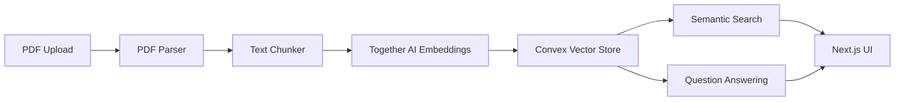

# PDF Analysis Feature Design

## Overview

A lightweight document analysis system that allows users to upload PDFs, search through their content, and ask questions about them using AI.

## System Design

### Architecture



### Components Breakdown

#### 1. PDF Processing

- **Library**: pdf-parse
- **Location**: `features/documents/utils/pdf.ts`
- **Key Functions**:
  - PDF text extraction
  - Basic metadata extraction (title, pages, etc.)
  - Error handling for corrupted files

#### 2. Text Processing

- **Library**: LangChain's RecursiveCharacterTextSplitter
- **Location**: `features/documents/utils/chunker.ts`
- **Configuration**:
  - Chunk size: 1000 tokens
  - Overlap: 200 tokens
  - Metadata preservation

#### 3. Vector Storage (Convex)

- **Schema**:

```typescript
// convex/schema.ts
{
  documents: {
    id: v.id("documents"),
    name: v.string(),
    chunks: v.array(v.object({
      text: v.string(),
      embedding: v.array(v.number()),
      metadata: v.object({
        page: v.number(),
        position: v.number()
      })
    })),
    userId: v.string(),
    _creationTime: v.number()
  },
  documentChunks: defineTable({
    fileId: v.id("files"),
    text: v.string(),
    metadata: v.object({
      page: v.number(),
      position: v.number(),
    }),
    vector: v.optional(v.array(v.number())),
    processedAt: v.optional(v.number()),
  })
}
```

#### 4. Embeddings & Search

- **Provider**: Together AI
- **Model**: together-embedding-v1
- **Location**: `features/documents/utils/embeddings.ts`
- **Key Functions**:
  - Text to vector conversion
  - Similarity search
  - Results ranking

#### 5. Question Answering

- **Model**: Llama 3.1 8B Turbo
- **Location**: `features/documents/utils/qa.ts`
- **Features**:
  - Context-aware responses
  - Source citations
  - Streaming output

### API Design

#### Convex Mutations

```typescript
// Upload & Process
uploadDocument: mutation({
  args: { name: v.string(), content: v.string() },
  handler: async (ctx, args) => {
    // Process PDF, chunk, embed, and store
  },
});

// Search
searchDocuments: query({
  args: { query: v.string() },
  handler: async (ctx, args) => {
    // Perform vector similarity search
  },
});

// Question Answering
askQuestion: action({
  args: { question: v.string(), documentId: v.id("documents") },
  handler: async (ctx, args) => {
    // Retrieve relevant chunks and generate answer
  },
});
```

### UI Components

- **Upload**: Drag & drop zone with progress indicator
- **Search**: Debounced search input with highlighted results
- **Chat**: Streaming response interface with document references

## Implementation Plan

### Phase 1: Infrastructure (Current)

1. [ ] Set up Convex schema
2. [ ] Configure Together AI client
3. [ ] Implement basic PDF parsing

### Phase 2: Core Features

1. [ ] Build upload component
2. [ ] Implement chunking and embedding
3. [ ] Create search interface

### Phase 3: Question Answering

1. [ ] Set up RAG pipeline
2. [ ] Add streaming responses
3. [ ] Build chat UI

## Cost Analysis

- Together AI embeddings: ~$0.0001 per 1K tokens
- Llama 3.1 8B Turbo: ~$0.0002 per 1K tokens
- Estimated cost per PDF (300KB): ~$0.05

## Future Considerations

- Batch processing for large documents
- Caching frequently accessed chunks
- Progressive loading for large result sets
- Error recovery and retry mechanisms

## PDF Viewer Implementation

### Core Components

- **Library**: @react-pdf-viewer/core + default-layout plugin
- **Location**: `features/files/components/PDFPreview.tsx`
- **Key Features**:
  - Built-in toolbar (zoom, navigation)
  - Memoized layout plugin
  - Error boundaries with typed handlers
  - Loading states
  - Accessibility support

### Usage

```tsx
<Worker workerUrl="/pdf.worker.min.js">
  <Viewer
    fileUrl={url}
    plugins={[defaultLayoutPluginInstance]}
    renderError={(error: LoadError) => /* error UI */}
    renderLoader={() => /* loading UI */}
  />
</Worker>
```

### Performance Notes

- Worker runs in separate thread
- Layout plugin instance is memoized
- Lazy loading for large files

## Embedding Configuration

### Similarity Thresholds

Based on empirical testing with our embedding model (togethercomputer/m2-bert-80M-8k-retrieval):

- Vector magnitudes average ~4.1
- Optimal similarity threshold: 4.0 (one vector magnitude)
- Resulting similarity ranges:
  - 90-100%: Nearly identical content/concepts
  - 60-89%: Strongly related content
  - 30-59%: Loosely related content
  - 0-29%: Unrelated content

### Business Implications

1. **Chunk Retrieval Strategy**:

   - Primary search: Use chunks with >60% similarity
   - Extended context: Include chunks with >30% similarity
   - Ignore chunks below 30% similarity

2. **Optimization Opportunities**:

   - Cache frequently accessed chunks with high similarity scores
   - Pre-compute similarity scores for common queries
   - Implement similarity score bands for tiered retrieval

3. **Next Steps**:
   - [ ] Implement similarity threshold in chunk retrieval logic
   - [ ] Add similarity score logging for query optimization
   - [ ] Create monitoring for retrieval quality using similarity bands
   - [ ] Consider adaptive thresholds based on query context

### Performance Monitoring

Monitor these metrics to ensure optimal retrieval:

- Distribution of similarity scores in successful queries
- Ratio of high-similarity (>60%) chunks in responses
- User satisfaction correlation with similarity thresholds

### Implementation Status (January 29, 2025)

#### Completed ✅

1. PDF Processing Pipeline
   - Text extraction with PDF.js v3.4.120
   - Chunking with metadata (page, position)
   - Convex storage with proper schema
   - Together.ai embeddings integration
   - Cascade delete implementation (files → chunks → embeddings → storage)

2. Embedding Generation
   - Model: togethercomputer/m2-bert-80M-8k-retrieval
   - Vector dimensions: 768
   - Batch processing of all chunks
   - Proper async handling with Convex actions
   - Status tracking (processing → processed)

3. Infrastructure & Types
   - PDF.js worker configuration
   - Together.ai API integration
   - Convex schema and mutations
   - Full TypeScript coverage
   - Error boundaries and recovery

#### In Progress 🚧

1. RAG Pipeline Components
   - ✅ Document Ingestion: Complete
   - ✅ Text Chunking: Complete
   - ✅ Embedding Generation: Complete
   - ❌ Vector Search: Not started
   - ❌ Context Retrieval: Not started
   - ❌ Answer Generation: Not started

2. Quality & Monitoring
   - ❌ Embedding quality monitoring
   - ❌ Similarity threshold tuning
   - ❌ Performance benchmarks
   - ❌ Error rate tracking

#### Known Limitations 🚨

1. Search & Retrieval
   - No vector similarity search implementation
   - Missing caching strategy for frequent searches
   - No context injection mechanism
   - No answer generation setup

2. Processing Resilience
   - No retry mechanism for failed chunks
   - Limited error handling in Together AI calls
   - No progress tracking UI
   - Basic error states in UI

3. Environment & Configuration
   - Together.ai API key management between environments
   - ✅ PDF.js version sensitivity (locked to 3.4.120)
   - Basic chunking strategy (no optimization yet)

#### Version Management 🔒

PDF.js version is managed through a centralized config:
```typescript
// lib/config/pdf.ts
export const PDF_CONFIG = {
  version: "3.4.120",
  get workerUrl() {
    return `https://unpkg.com/pdfjs-dist@${this.version}/build/pdf.worker.min.js`;
  }
} as const;
```

Current approach:
- Single source of truth for version number
- Consistent worker URL generation
- Easy version updates
- Type-safe version reference
- Runtime version validation

#### Architectural Concern 🚨

Current implementation uses PDF.js for both viewing and parsing:
```typescript
// Viewing (PDFPreview.tsx)
import { Worker, Viewer } from "@react-pdf-viewer/core";

// Parsing (processor.ts)
import * as pdfjs from "pdfjs-dist";
```

This coupling creates several issues:
1. Version lock affects both viewing and parsing
2. Any PDF.js instability impacts both features
3. Harder to optimize each concern separately

Future Consideration:
- Separate viewing and parsing concerns
- Use specialized library for parsing (e.g., pdf-lib, pdf-parse)
- Keep PDF.js only for viewing
- Independent versioning for each concern

Benefits:
- More stable parsing pipeline
- Easier to update viewing component
- Better separation of concerns
- Reduced risk from PDF.js updates

#### Next Steps 🎯

1. Vector Search Implementation
   - Design similarity search endpoint
   - Implement chunk retrieval logic
   - Add caching layer for frequent searches
   - Set up monitoring for search quality

2. RAG Pipeline Completion
   - Design prompt engineering strategy
   - Implement context injection
   - Set up answer generation
   - Add source citations

3. Quality Improvements
   - Add retry mechanism for failed chunks
   - Implement embedding quality monitoring
   - Add comprehensive error handling
   - Set up performance benchmarks
